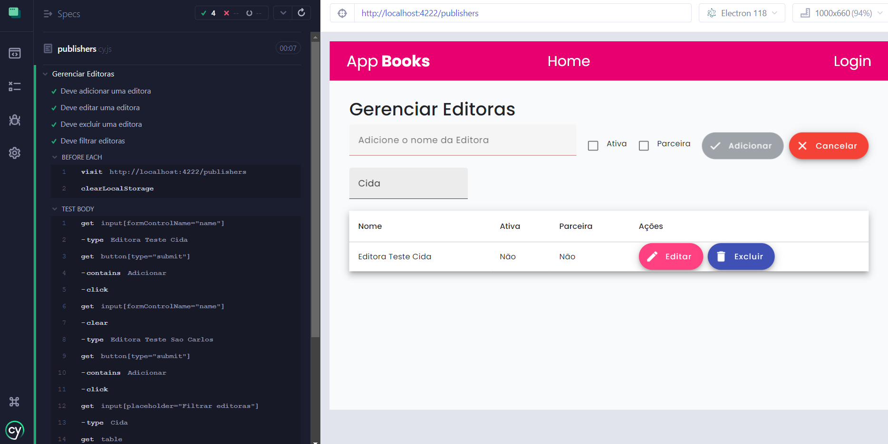
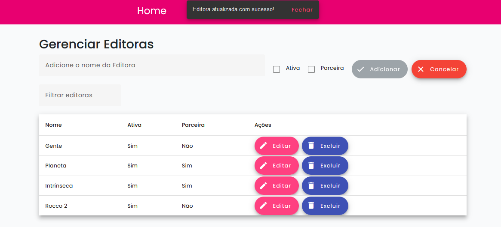

# Micro Frontend Angular 

Mono repositório contendo duas aplicações Front-end Angular 16, gerenciadas pelo Module Federation.
O micro frontend host-app é o orquestrador que atende na porta 4222 e mfe-app é a aplicação remota que expõe componentes no host-app e roda na porta 4333.

O fluxo da aplicação inicia na página de boas vindas Home, permitindo o usuário clicar no link Login, inserindo as credenciais cida@app.com senha 1234, será direcionado para a listagem de livros, podendo inserir, atualizar e excluir livros. E nesta mesma listagem, existe o botão no canto superior direito ver editoras que permite a navegação para as operações de CRUD em localstorage relacionadas com as editoras.

## Como rodar as aplicações micro frontend Angular:

1. **Clone o repositório:**
  ```bash
    git clone https://github.com/cidaluna/mfe-angular.git
  ```

2. **Navegue no diretório principal**
```bash
  cd mfe-angular
```

3. **Navegue no diretório backend**
  ```bash
    cd backend
  ```

4. **Inicie a API Json Server**
  ```bash 
    json-server --watch db.json --port 4000
  ```

5. **Abra um novo terminal no diretório do projeto e execute os comandos**
  ```bash 
    npm install
  ```

6. **Execute a aplicação host-app**
  ```bash 
    ng serve host-app 
  ```

7. **Abra um novo terminal e execute a aplicação mfe-app**
  ```bash 
    ng serve mfe-app 
  ```

Exemplo no terminal:  


7. **Navegue nas URLs que o comando anterior apresentou**

Host-app: http://localhost:4222

Mfe-app:  http://localhost:4333


## Como rodar os testes Jasmine/Karma:

1. **Navegue no diretório da aplicação desejada**
  ```bash
    cd host-app
  ```

2. **Execute o comando**
  ```bash
    ng test
  ```

## Como rodar os testes Cypress/e2e:

1. **Navegue até o diretório mfe-app**
```bash
   cd projects/mfe-app
```

2. **No diretório do micro frontend mfe-app, execute o comando**
```bash
  npx cypress open
```

3. **Será aberta uma tela, clique na opção E2E Testing**

4. **Clique no navegador de sua preferência e clique em Start**

5. **Clique em publishers.cy.js**

6. **Acompanhe o resultado dos testes Cypress na tela**


Testes com o Cypress E2E realizando CRUD Localstorage na tela de editoras:




### Pre-Requisitos
- Node.js 18
- Angular CLI 16

### Tecnologias

- Angular 16, 
- Angular Material,
- Webpack,
- Module Federation,
- Node.js,
- Boostrap,
- Ícones Angular Material,
- JSON Server,
- Jasmine Karma,
- Cypress


### Considerações sobre o desafio

Tive dificuldade ao tentar estabelecer a arquitetura proposta, especialmente na integração do Angular 17 com suas dependências, particularmente no que diz respeito ao Module Federation do Webpack. Como resultado, decidi explorar a versão 16 do Angular, onde consegui realizar a integração com sucesso. Essa abordagem alternativa me permitiu avançar no projeto e garantir a funcionalidade de carregar a modularização desejada.

### Sobre o Backend

Cada micro frontend deve ter um service responsável pela comunicação com o backend, realizando chamadas HTTP para a API.

As URLs podem ser configuradas nos arquivos environment.ts e environment.prod.ts, facilitando a troca entre ambientes. Além disso, é possível implementar criptografia, autenticação, uso de tokens, configurar proxy entre outros para proteger as requisições, estabelecer a comunicação entre as aplicações e manter a segurança dos dados compartilhados.

Com os services configurados, os componentes podem realizar as operações de manipulação de dados e renderizar na tela os módulos necessários, atendendo a arquitetura de modularidade e escalabilidade, considerando as regras de negócio do produto e proporcionando uma experiência agradável ao cliente.


Quando o backend real estiver disponível, configuramos todos os arquivos de ambiente com as URLs corretas e realizamos os testes de ponta a ponta para garantir a integração do Frontend com o Backend nos ambientes de desenvolvimento, homologação e produção.


### Documentação

Criando o mono repositório:

`ng new mfe-angular --create-application=false`

`cd mfe-angular`

Criando as aplicações micro frontends:

`ng g application host-app --routing --no-standalone --style=scss`

`ng g application mfe-app --routing --no-standalone --style=scss`

Instalando o Webpack:

`npm i webpack webpack-cli --save-dev`

Configurando Module Federation:

`npm install @angular-architects/module-federation`

`ng add @angular-architects/module-federation --project host-app --port 4222`

`ng add @angular-architects/module-federation --project mfe-app --port 4333`

Outros comandos:

`npm cache clean --force`

Dependências:

`npm i json-server`

`npm i cypress`

`npm i @angular/material` Utilizado SnackBar para notificações de erro, Dialog para abrir o modal, alguns botões e para campos de formulário do componente livro.


## Screenshots

Tela Home com login no Host Application:


Tela listagem de livros CRUD feito com API JSON Server do MFE no Host Application:


Formulário adicionar livro:


Validações do formulário:


Campos preenchidos:


Filtro e paginação para buscar livro:


Tela de editoras com CRUD (Adicionar, Listar, Editar e Excluir) salvando em LocalStorage:


Barra de notificações com snackBar:




