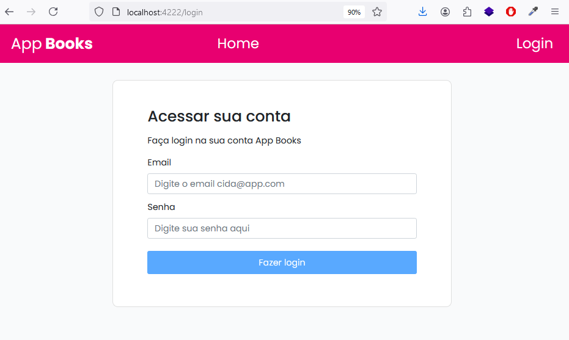

# Micro Frontend Angular (em desenvolvimento)

Mono repositório contendo duas aplicações Front-end Angular 16, gerenciadas pelo Module Federation.
O micro frontend host-app é o orquestrador que atende na porta 4222 e mfe-app é a aplicação remota que expõe componentes no host-app e roda na porta 4333.

## Como rodar o backend

Utilize o comando `cd backend`

Em seguida, o comando `json-server --watch db.json --port 4000` que irá iniciar o JSON Server

## Como rodar a aplicação Angular

Com o comando `ng serve host-app` navegue na URL `http://localhost:4222/` e confira a aplicação host rodando.

Exemplo no terminal:  

Com o comando `ng serve mfe-app` navegue na URL `http://localhost:4333/` e confira a aplicação mfe rodando.

### Tecnologias

- Angular 16, 
- Angular Material,
- Webpack,
- Module Federation,
- Node.js,
- Boostrap,
- Ícones Angular Material,
- JSON Server,
- Jasmine Karma,
- Cypress

### Considerações sobre o desafio

Tive dificuldade ao tentar estabelecer a arquitetura proposta, especialmente na integração do Angular 17 com suas dependências, particularmente no que diz respeito ao Module Federation do Webpack. Como resultado, decidi explorar a versão 16 do Angular, onde consegui realizar a integração com sucesso. Essa abordagem alternativa me permitiu avançar no projeto e garantir a funcionalidade de carregar a modularização desejada.

### Documentação

Criando o mono repositório:

`ng new mfe-angular-app --create-application=false`

`cd mfe-angular-app`

Criando as aplicações micro frontends:

`ng g application host-app --routing --no-standalone --style=scss`

`ng g application mfe-app --routing --no-standalone --style=scss`

Instalando o Webpack:

`npm i webpack webpack-cli --save-dev`

Configurando Module Federation:

`npm install @angular-architects/module-federation`

`ng add @angular-architects/module-federation --project host-app --port 4222`

`ng add @angular-architects/module-federation --project mfe-app --port 4333`

Outros comandos:

`npm cache clean --force`

Dependências:

`npm install cypress --save-dev`

`npx cypress open`

### Screenshot

Tela Home com login no Host Application

Tela listagem de livros do MFE no Host Application

Formulário adicionar livro

Validações do formulário

Campos preenchidos

Filtro e paginação para buscar livro

