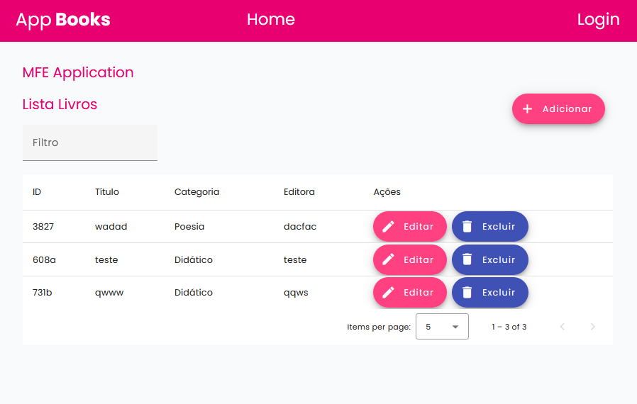

# Micro Frontend Angular (em desenvolvimento)

Mono repositório contendo duas aplicações Front-end Angular 16, gerenciadas pelo Module Federation.
O micro frontend host-app é o orquestrador que atende na porta 4222 e mfe-app é a aplicação remota que expõe componentes no host-app e roda na porta 4333.

## Como rodar as aplicações micro frontend Angular:

1. **Clone o repositório:**
  ```bash
    git clone https://github.com/cidaluna/mfe-angular.git
  ```
  
2. **Navegue no diretório backend**
  ```bash
    cd backend
  ```

3. **Inicie a API Json Server**
  ```bash 
    json-server --watch db.json --port 4000
  ```

4. **Abra um novo terminal no diretório do projeto e execute os comandos**
  ```bash 
    npm install
  ```

5. **Execute a aplicação host-app**
  ```bash 
    ng serve host-app --port 4222
  ```

6. **Abra um novo terminal e execute a aplicação mfe-app**
  ```bash 
    ng serve mfe-app --port 4333
  ```

Exemplo no terminal:  


7. **Navegue nas URLs que o comando anterior abriu**


## Como rodar os testes Jasmine/Karma:

1. **Navegue no diretório da aplicação desejada**
  ```bash
    cd host-app
  ```

2. **Execute o comando**
  ```bash
    ng test
  ```

## Como rodar os testes Cypress/e2e:

1. **Execute o comando**
```bash
  npx cypress open
```

Exemplo do Cypress na tela principal do host:


### Pre-Requisitos
- Node.js
- Angular CLI

### Tecnologias

- Angular 16, 
- Angular Material,
- Webpack,
- Module Federation,
- Node.js,
- Boostrap,
- Ícones Angular Material,
- JSON Server,
- Jasmine Karma,
- Cypress


### Considerações sobre o desafio

Tive dificuldade ao tentar estabelecer a arquitetura proposta, especialmente na integração do Angular 17 com suas dependências, particularmente no que diz respeito ao Module Federation do Webpack. Como resultado, decidi explorar a versão 16 do Angular, onde consegui realizar a integração com sucesso. Essa abordagem alternativa me permitiu avançar no projeto e garantir a funcionalidade de carregar a modularização desejada.


### Documentação

Criando o mono repositório:

`ng new mfe-angular-app --create-application=false`

`cd mfe-angular-app`

Criando as aplicações micro frontends:

`ng g application host-app --routing --no-standalone --style=scss`

`ng g application mfe-app --routing --no-standalone --style=scss`

Instalando o Webpack:

`npm i webpack webpack-cli --save-dev`

Configurando Module Federation:

`npm install @angular-architects/module-federation`

`ng add @angular-architects/module-federation --project host-app --port 4222`

`ng add @angular-architects/module-federation --project mfe-app --port 4333`

Outros comandos:

`npm cache clean --force`

Dependências:

`npm install cypress --save-dev`

`npx cypress open`

### Screenshot

Tela Home com login no Host Application:


Tela listagem de livros do MFE no Host Application:



Formulário adicionar livro:


Validações do formulário:


Campos preenchidos:


Filtro e paginação para buscar livro:


